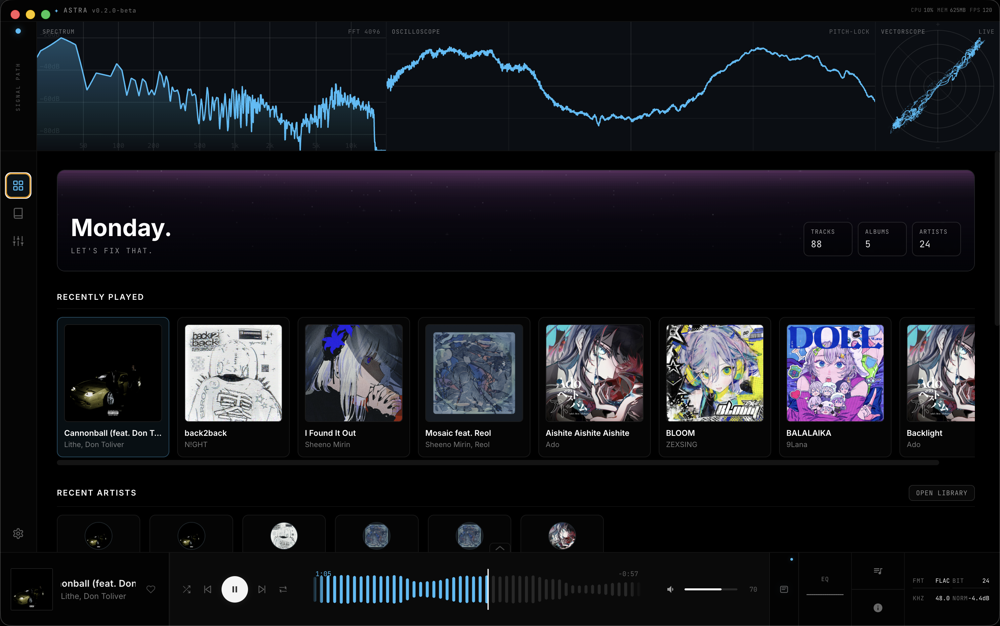

# Astra

A desktop music player for people who still have a music library.




Astra is a music player built around local files, FLACs, MP3s, whatever your collection looks like. It started as a side project and ended up with a native C++ DSP engine, real-time visualizers, multichannel audio remapping, Atmos decoding, and a lot more. No telemetry, no accounts, no streaming, just your music.


## Playback

Gapless playback with pre-buffering so albums flow the way they're supposed to. Supports MP3, FLAC, WAV, OGG, AAC, M4A, OPUS, WMA, and AIFF natively, with an FFmpeg fallback for anything beyond that. Practically everything works out of the box, including Dolby Atmos multichannel decoding even without an Atmos-compatible device. Shuffle, repeat, and a drag-and-drop queue handle the basics.

## Visualizers

Three real-time visualizers powered by a native C++ module, an oscilloscope with adaptive zero-crossing pitch-lock, a spectrum analyzer with configurable FFT, and a vectorscope for stereo phase imaging. The analysis path runs independently from your output routing, so the scopes always reflect the source material rather than the processed output.

## Equalizer

A fully parametric EQ with up to 10 bands, a live frequency response graph with spectrum overlay, and built-in presets. You can save your own, and AutoEQ headphone calibration profiles import directly if you use those.


## Library

Point Astra at your music folders and it takes care of the rest, metadata extraction, album artwork, and a searchable library you can browse by artist, album, or track. There's also a global fuzzy search shortcut so you can find anything without touching the mouse. Favorites and recently played are tracked automatically, and the built-in metadata editor lets you fix tags without leaving the player.

## Audio Settings

Output device selection, loudness normalization, per-channel remapping for multichannel setups, and delay calibration for wireless or Bluetooth speakers. ReplayGain support is coming in a future update.

## The Rest

Fullscreen mode with an album art backdrop and ambient spectrum, a miniplayer for when you want it out of the way, and a home page with a sky that shifts with the time of day. The interface pulls its accent color from whatever's playing, or you can pick from a handful of dark themes and set your own. There's an info sidebar for track technical details, and Discord Rich Presence with cover art support if you want to share what you're listening to.

## Astra API

Astra exposes an optional opt-in local API so you can build integrations with other software, read the current track, playback position, and cover art from outside the player. Playback control over the API is available too. Everything that touches the network in Astra is optional and off by default.

## Download

Prebuilt binaries for Windows, macOS, and Linux are available on the [Releases](https://github.com/Boof2015/astra/releases) page.

## Building from Source

You'll need Node.js 18+, npm, and a C++ compiler toolchain (Xcode CLI tools on macOS, Visual Studio Build Tools on Windows, or `build-essential` on Linux).

```bash
git clone https://github.com/Boof2015/astra.git
cd astra
npm install
```

The `postinstall` script compiles the native C++ visualizer module for your platform.

```bash
npm run dev              # Development
npm run build            # Build application assets
npm run dist             # Package for current platform
npm run dist:mac         # macOS (DMG + ZIP)
npm run dist:win         # Windows (NSIS + Portable)
npm run dist:linux       # Linux (AppImage + DEB)
```

## Documentation

For detailed technical documentation, see the [Wiki](https://github.com/Boof2015/astra/wiki).

## Support

If you find Astra useful and want to support a broke college student, consider supporting development:

[](https://ko-fi.com/boof2015)

## License

This project is licensed under the [GNU General Public License v3.0](https://www.gnu.org/licenses/gpl-3.0.html). See [LICENSE](LICENSE) for the full text.

## Star History

<a href="https://www.star-history.com/#Boof2015/astra&type=date&legend=top-left">
 <picture>
   <source media="(prefers-color-scheme: dark)" srcset="https://api.star-history.com/svg?repos=Boof2015/astra&type=date&theme=dark&legend=top-left" />
   <source media="(prefers-color-scheme: light)" srcset="https://api.star-history.com/svg?repos=Boof2015/astra&type=date&legend=top-left" />
   
 </picture>
</a>
