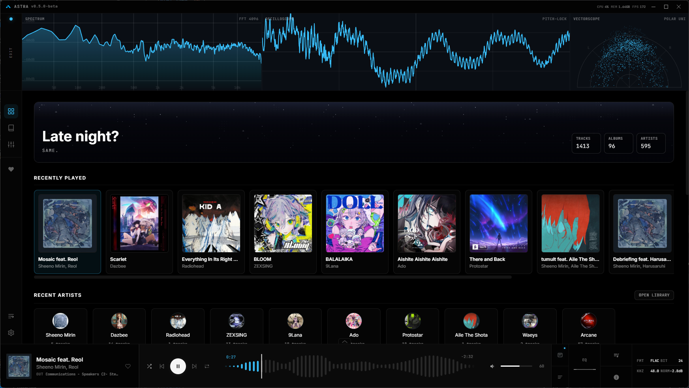
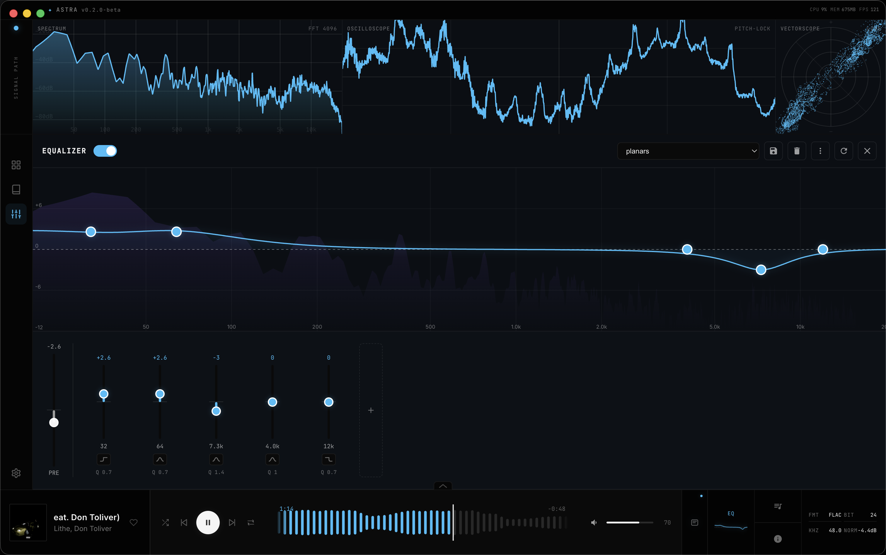
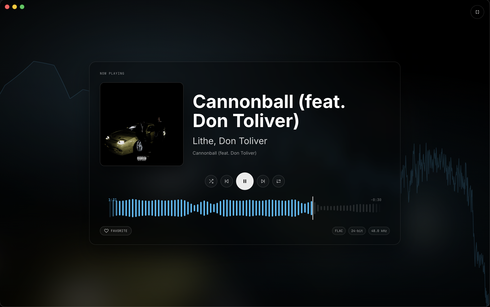
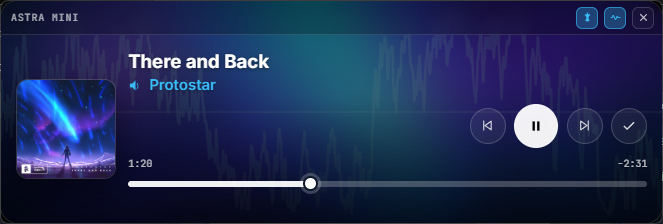
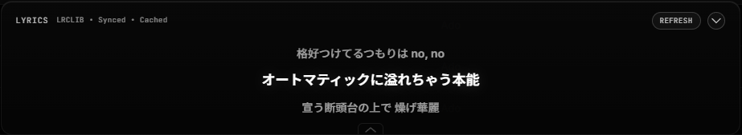

# Astra

A desktop music player for people who still have a music library. <a href="https://repology.org/project/astra-music/versions">
    
</a>




Astra plays your local music - FLACs, MP3s, whatever your collection looks like. It has a native C++ DSP engine, real-time visualizers, a parametric EQ, Dolby Atmos decoding, synchronized multi-room playback, scrobbling, and a UI that adapts to your music. No telemetry, no accounts, no streaming.

## Playback

Gapless playback with pre-buffering so albums flow the way they were intended. Supports MP3, FLAC, WAV, OGG, AAC, M4A, OPUS, WMA, AIFF, ALAC, APE, and WavPack natively, with an FFmpeg fallback for anything else.

Bit-perfect output bypasses the OS mixer for direct hardware delivery — WASAPI Exclusive on Windows, CoreAudio HAL on macOS, and ALSA hw on Linux.

## Spatial Audio

Astra is the first general purpose desktop music library player with native IAMF/Eclipsa Audio playback.

Astra treats Eclipsa Audio and IAMF as first-class local music formats. IAMF tracks are identified in the library, expose their rendered channel layout, and can be browsed, searched, queued, and played like any other track.

Decoding and rendering are performed locally through the Astra Spatial Engine. Channel-based and scene-based content can be rendered binaurally for headphones, delivered directly to multichannel hardware, or adapted to the available output layout. No Eclipsa-certified playback hardware is required.

Dolby Atmos multichannel decoding is also supported without Atmos-compatible hardware.

Astra provides per-channel inspection and remapping, output delay calibration, and a Virtual Speaker Room for placing virtual speakers in 3D space. Drag them around the listener, add height/elevation, and hear the binaural render update live as you move them.

## Parallax

Play the same music in perfect sync across multiple machines on your local network. One machine hosts and controls playback; any number of others join as speakers and stay locked to it. A guided setup walks each machine through its role, speakers are paired with a PIN over the LAN, and per-speaker delay tuning corrects anything that sounds early or late. Playback stays gapless across track boundaries on every speaker. Local network only, no accounts, no cloud.

Parallax is opt-in and still experimental (though stable) enable it from the Experimental section of Settings to reveal its controls.

## Visualizers

Seven real-time visualizers powered by a native C++ module - oscilloscope, spectrum analyzer, vectorscope, and more. The entire scope rack is customizable: pick your scopes, drag and resize them into any layout, and save presets. The analysis path runs independently from output routing, so scopes always reflect the source material.

## Equalizer

Up to 20 fully parametric bands, a live frequency response graph with spectrum overlay, and built-in presets. Save your own, or import AutoEQ headphone calibration profiles directly.



## Library

Point Astra at your music folders and it handles metadata extraction, album artwork, and a searchable library you can browse by artist, album, or track. Reads ID3v2.4 and Vorbis Comments, parses multiartist tags properly, supports custom artist images, and scans `.lrc` files by filename. Favorites and recently played are tracked automatically, and the built-in metadata editor lets you fix tags without leaving the player. A Quick Launch palette and full keyboard shortcuts get you anywhere without touching the mouse.

## Audio Settings

Output device selection, loudness normalization with ReplayGain support, per-channel remapping for multichannel setups, and delay calibration for wireless or Bluetooth speakers.

## Interface

The seek bar renders the actual waveform of the current track. Fullscreen mode shows album art with an ambient spectrum backdrop.



The mini player keeps controls accessible when you want Astra out of the way.



There's also synced lyrics with auto-scroll, pulled automatically from embedded lyrics, an .lrc file, or from LRCLIB. The lyrics panel pops out into its own window if you want it somewhere else.



## Scrobbling

Built-in support for Last.fm, AudioScrobbler, and ListenBrainz, plus a custom scrobbler profile system if you're running your own endpoint. Built in multiscrobble lets you submit to as many services as you want at once.

## Integrations

Everything that touches the network is optional and off by default.

- **Discord Rich Presence** - show what you're listening to with cover art, with options for how the presence is laid out
- **Self-hosted media servers** - Jellyfin, plus any Subsonic-compatible server (Navidrome, Airsonic, Gonic, Funkwhale, etc.)

## Astra API

An optional local REST API lets external tools read the current track, playback position, and cover art, or control playback. Loopback only, bearer token auth, disabled by default. See the [API docs](https://github.com/Boof2015/astra/wiki/Astra-API) for details.

## Experimental

Opt-in experimental features that may get changed or removed based on feedback:

- **PWA phone controller** - control playback from your phone over local network, with system media controls and a QR code pairing wizard - now supports Astra mobile
- **Library integrity scanner** - find broken files, missing metadata, and quality issues across your library
- **Graph visualization** - additional visualizer mode to see connections between artists in your library
- **Ambient stereo-to-multichannel upmix** - fills the rear channels on multichannel setups when you're playing stereo files
- **5×5 grid activity indicator** - shows what Astra is doing in the background
- **Controller support** - navigate Astra with an Xbox or PlayStation controller: D-pad/stick to move, A/Cross to select, bumpers for tabs, stick-clicks to jump to the sidebar or now playing

## Download

Prebuilt binaries for Windows, macOS, and Linux are available on the [Releases](https://github.com/Boof2015/astra/releases) page.

Officially available on the [AUR](https://aur.archlinux.org/packages/astra-music-bin) (`astra-music-bin`).

Windows users can also `winget install Boof2015.Astra`

### Community maintained packages

These packages are maintained by third parties and are not built, audited, or officially supported by the Astra project. Packaging, signing, updates, and distribution are handled by their respective maintainers.

- [AUR](https://aur.archlinux.org/packages/astra-music-git) - community maintained AUR source package
- [TerraPKG](https://terrapkg.com/) - community maintained Fedora/RPM package

## Building from Source

**Prerequisites:** Node.js 18+, npm, and a C++ compiler toolchain.

| Platform | Toolchain |
|----------|-----------|
| macOS | Xcode Command Line Tools |
| Windows | Visual Studio Build Tools |
| Linux | `build-essential`, `python3`, `libasound2-dev` |

```bash
git clone https://github.com/Boof2015/astra.git
cd astra
npm install
```

The `postinstall` script compiles the native C++ visualizer module for your platform.

```bash
npm run dev              # Development
npm run build            # Build application assets
npm run dist             # Package for current platform
npm run dist:mac         # macOS (DMG + ZIP)
npm run dist:win         # Windows (NSIS + Portable)
npm run dist:linux       # Linux (AppImage + DEB + RPM + tarball)
```

## Documentation

For detailed technical documentation, see the [Wiki](https://github.com/Boof2015/astra/wiki).

## Support

If you find Astra useful and want to support a broke college student, consider supporting development:

[](https://ko-fi.com/boof2015)

## License

This project is licensed under the [GNU General Public License v3.0](https://www.gnu.org/licenses/gpl-3.0.html). See [LICENSE](LICENSE) for the full text.

## Star History

<a href="https://www.star-history.com/?type=date&legend=top-left&repos=Boof2015%2Fastra">
 <picture>
   <source media="(prefers-color-scheme: dark)" srcset="https://api.star-history.com/chart?repos=Boof2015/astra&type=date&theme=dark&legend=top-left" />
   <source media="(prefers-color-scheme: light)" srcset="https://api.star-history.com/chart?repos=Boof2015/astra&type=date&legend=top-left" />
   
 </picture>
</a>
